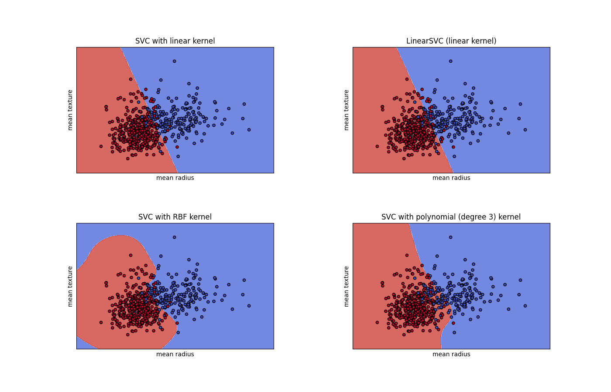

# Apartat B

En aquest primer apartat farem servir el dataset de càncer de pit de la llibreria sklearn.
Provarem diferents models amb particions de test de mides diferents. L'objectiu és veure
quin funciona millor pel dataset seleccionat.

## Introducció al dataset
L'objectiu d'aquest dataset és detectar si un tumor és benigne o no. Per fer-ho tenim una
sèrie de features com ara la textura, el radi, etc. En total hi ha 30 features.

## Comparativa de models
Per fer la comparativa hem escollit 4 models: Regressió Logística, SVC amb el kernel rbf
KNN i Random Forest. A l'hora d'entrenar els models ho hem fet variant el percentatge de
train i test. En la primera iteracó ho fem amb un 0.5 de test i 0.5 de train, la segona
iteració amb un 0.3 de test i un 0.7 de train i finalment l'última amb un 0.2 de test i
un 0.8 de train. A continuació mostrem els resultats obtinguts:

            LogisticRegression      SVC     KNN     RandomForestClassifier
    50%                   0.96     0.97    0.95                       0.95
    70%                   0.95     0.98    0.96                       0.98
    80%                   0.96     0.97    0.96                       0.96

Com podem observar tots els models han funcionat bastant bé independentment de 
la mida de les particions. Entre ells podem destacar el SVC com el que millor 
ha funcionat, però tot i això, molt proper a la resta. Per tant sembla que per 
al dataset escollit tots els models provats ens servirien.

A continuació donarem un cop d'ull a les corbes ROC i Precision-Recall. Per generar les
corbes s'ha fet servir una partició del 80% de train i 20% de test.

{ width=300px }
{ width=300px }

{ width=300px }
{ width=300px }

{ width=300px }
{ width=300px }

{ width=300px }
{ width=300px }

Com es pot veure a les gràfiques anteriors el SVC te una corba pràcticament perfecte, tant
les corbes ROC com les PR, amb l'àrea molt propera a 1. El Random Forest és l'altre amb
el que hem obtingut molts bons resultats, també amb una àrea molt propera a 1.
Els altres dos models tot i que no han obtingut resultats tan perfectes s'hi apropen molt.

Per últim ens quedaria mirar com afecta el valor de C als diferents kernels del SVC. Hem 
creat una visualització per veure-ho gràficament:

{ width=600px }
\begin{center}
C = 0.1
\end{center}

{ width=600px }
\begin{center}
C = 0.5
\end{center}

{ width=600px }
\begin{center}
C = 1
\end{center}

El valor de C no afecta al kernel lineal pero si que canvia el resultat del kernel rbf
que acota més la classificació del vermell respecte a la versió amb la C de 0.1. Tot i
així en cap dels 3 casos obtenim gaires classificacions errones.

# Apartat A
De cara a aquest apartat ja ens enfocarem en un dataset amb més dades i d'on hi podem
treure més suc. Igual que en l'apartat anterior probarem diversos models per trobar el
que funciona millor i també farem probes per veure quins parametres fan funcionar millor
cada model.

## Exploratory Data Analysis

Aquest dataset està destinat a crear protesis robotiques que permetin a un
usuari sense braç moure la protesi al seu gust.

Per tant el gest que estigui fent aquesta persona serà el target, ja que ens 
interessa preveure quin gest fa la persona per així moure el braç robotic a 
aquesta posició.

El dataset conte dades registrades de 8 sensors situats a l'avantbraç d'una 
persona mentre fa un dels 4 gestos predefinits. Aquests 4 gestos són els 
següents:

    0: pedra
    1: tisores
    2: paper
    3: ok

El número indica com identifiquem el gest dins del dataset.

El dataset disposa de 65 atributs 64 dels quals són les lectures dels sensors
(disposem de 8 sensors i realitzem 8 lectures a cada sensor per tant $8 \cdot 8 = 64$).
L'altre atribut restant és el gest que està realitzant la persona. Els atributs
tots són numèrics.

Hem mirat a veure si hi ha alguna correlació entre X i y, però no veiem cap
correlació directa entre els valors dels diferents sensors i el gest resultant.
Podem veure-ho reflectit en el correlation plot següent:

{ width=475px }

Les etiquetes estan balancejades. Hi ha pràcticament la mateixa quantitat de cada etiqueta:

0: 2910, 1: 2903, 2: 2943, 3: 2922

Totes les etiquetes tenen una distribució Gaussiana.
Es pot observar la distribució en els següents pairplots (d'esquerra a dreta: Gest 0, Gest 1, Gest 2, Gest 3)

{ width=300px }
{ width=300px }
{ width=300px }
{ width=300px }

Per tant no creiem que ens pugui donar problemes a l'hora de fer una predicció.

## Preprocessing
Per començar hem de preparar les dades per a poder fer coses amb elles, per tant
començarem normalitzant-les, ja que els valors dels diferents sensors
varien molt entre ells. També hem de mirar que les dades no siguin nul·les o
buides, ja que aquestes podrien interferir a l'hora d'aplicar diferents mètodes
d'aprenentatge, per sort el nostre dataset no en tenia cap i no hem hagut de
fer cap neteja. També hem determinat que les dades són totes numèriques,
ja que les classes ja venen codificades, i per tant no fa falta que ho fem nosaltres.

Ens hem plantejat a fer servir una descomposició PCA, però com que no hem trobat cap
patró específic a les dades, podem deduir que no serà una bona manera per reduir
les dimensions. També hem considerat aplicar PolynomialFeatures, però no tindria
massa sentit, ja que en el nostre cas tenim un dataset prou gran per a poder fer
una bona predicció.

## Model Selection
De cara a fer les prediccions hem provat diversos models, per veure qui és el que funciona
millor amb el nostre dataset. Els models que hem provat són els següents:

- Logistic Regression
- SVC amb rbf kernel
- SVC amb linear kernel
- KNN
- Random Forest
- Perceptron
- Decision Tree

Hem provat tots els models i hem mirat quina és l'accuracy de cada un d'ells.
Els models que ens han brindat millor resultats són SVC amb el kernel rbf i
Random Forest, tots dos amb un accuracy de més del 90%. La resta de models els
resultats no han sigut especialment bons, sobretot els que separen les dades
linealment com el SVC amb el kernel linear o la regressió logística. Això és
degut al fet que les nostres dades no són divisibles linealment.

Pel que fa a la velocitat d'entrenament dels models tots han sigut força ràpids
(qüestió de segons), excepte al SVC que era el més lent i ens ha tardat pocs
minuts.

Respecte als ensembles hem vist que funcionen força bé amb el nostre dataset
com hem pogut veure amb el Random Forest.

Els resultats numèrics es poden veure amb més detall a l'\underline{\hyperref[annex:1]{Annex 1}}.

## Cross-validation

Per assegurar que el nostre model és bo farem servir crossvalidation, ja que a
vegades es pot donar el cas que hàgim tingut sort a l'hora de dividir les dades
i hàgim obtingut un bon resultat, però que realment no tinguem un bon model.
Al fer cross-validation ens assegurem que el model és bo, ja que provem amb
diverses combinacions de dades i comprovem a veure si l'accuracy segueix sent bona
o no.

A l'hora d'aplicar el cross validation hem provat diferents valors de k, des de
2 fins a 9. Més o menys hem obtingut els mateixos resultats amb els diferents
valors de k. Al tindre un dataset bastant gran considerem que aplicar el
LeaveOneOut no ens surt rentable ja que el temps necessari per aplicar-ho és
massa gran.

És important també trobar un balanç quan separarem la base de dades en conjunts
de train i test, ja que si hi ha masses dades de train no tindrem suficients
dades per poder comprovar que el model estigui funcionant correctament, i si
tenim masses dades de test no tindrem suficients dades per entrenar el model i
que per tant pugui fer bones prediccions. Nosaltres hem trobat que amb un 80%
train i 20% test ens ha funcionat força bé.

## Metric Analysis 
Per fer l'anàlisi mètric hem considerat les mètriques accuracy_score, f1_score
i average_precision_score. Pel nostre problema les tres mètriques donen
pràcticament el mateix resultat, ja que les nostres dades estan molt
balancejades, per tant les tres mètriques són igual d'adients pel nostre dataset.

Farem servir la Precision Recall Curve i la ROC curve. Les dues ens poden ser
d'utilitat, ja que el nostre dataset està balancejat. La PR Curve mostra la
relació entre la precisió i el recall per tant volem que el final de la corba
sigui el màxim possible, és a dir, el més proper a 1. En canvi, la ROC Curve
mostren la comparació entre la ràtio de positius verdaders i la ràtio de positius
falsos.

PR curves: 

{ width=300px }
{ width=300px }
{ width=300px }
{ width=300px }
{ width=300px }
{ width=300px }

ROC curves:

{ width=300px }
{ width=300px }
{ width=300px }
{ width=300px }
{ width=300px }
{ width=300px }

Amb les corbes anteriors podem veure clarament el que comentàvem abans, els
classificadors lineals tenen un rendiment molt baix, mentre que el SVC amb el
kernel rbf i el Random Forest brinden molt bons resultats amb una àrea entre
0.95 i 1, depenent de la classe. El que resulta interessant destacar és que
tots els models tenen més dificultats a classificar la classe 3 (gest Ok), que
la resta de classes. Això és probable que sigui perquè els sensors no captin
valors gaire específics a l'hora de fer el gest Ok, i per tant al classificador
té més problemes a l'hora d'identificar-lo.

El classification_report mostra els scores de precisió, recall f1-score i el
suport dels diferents mètodes que hem utilitzat. Els resultats numèrics es poden
veure amb més detall a l'\underline{\hyperref[annex:1]{Annex 1}}.

## Hyperparameter Search
- Quines formes de buscar el millor parametre heu trobat? Són costoses computacionalment parlant?

Hem trobat els mètodes de GridSearchCV i RandomizedSearchCV de Sklearn. El
GridSearchCV rep un diccionari i el número de cross validations a fer, i el que
fa és a partir dels valors donats en el diccionari, els associa amb els
paràmetres del model i troba els millors valors. El RandomizedSearchCV funciona
de manera similar al GridSearchCV però aplicant l'atzar. Rep com a paràmetres
la quantitat d'iteracions a fer i el número de cross validations. El cost és
menor en el RandomizedSearchCV, però sacrificant la possibilitat de no trobar
els valors òptims pel model, cosa que sí que assegura més el GridSearchCV a
costa de ser més costos i per tant més lent.

- Si disposem de recursos limitats (per exemple, un PC durant 1 hora) quin dels dos métodes creieu que obtindrà millor resultat final?

RandomizedSearchCV, ja que evita provar combinacions innecessàries, i per tant la complexitat computacional
és menor. A canvi sacrifiques el fet que poder els resultats que trobes no són els òptims.

- Feu la prova, i amb el model i el metode de crossvalidació escollit, configureu els diferents metodes de búsqueda per a que s'executin durant el mateix temps (i.e. depenent del problema, 0,5h-1 hora). Analitzeu quin ha arribat a una millor solució. (estimeu el temps que trigarà a fer 1 training, i aixi trobeu el número de intents que podeu fer en cada cas.)

Per trobar el millor paràmetre hem trobat els mètodes de GridSearchCV i
RandomizedSearchCV de Sklearn. El GridSearchCV rep un diccionari i el número de
cross validations a fer, i el que fa és a partir dels valors donats en el
diccionari, els associa amb els paràmetres del model i troba els millors valors.
El RandomizedSearchCV funciona de manera similar al GridSearchCV però aplicant
l'atzar. Rep com a paràmetres la quantitat d'iteracions a fer i el número de
cross validations. El cost és menor en el RandomizedSearchCV, però sacrificant
la possibilitat de no trobar els valors òptims pel model, cosa que sí que
assegura més el GridSearchCV a costa de ser més costos i per tant més lent.
Nosaltres hem decidit fer servir el GridSeatchCV, però si tinguéssim temps limitat
seria millor fer servir el RandomizedSearchCV. Hem obtingut els següents
resultats:

### Parametres
    'LogisticRegression': {'penalty': ['l1', 'l2'], 'C': [0.01, 0.1, 1, 10, 100, 1000]},
    'SVC rbf': {'C': [0.1, 1, 10, 100], 'gamma': [0.01, 0.1, 1, 10]},
    'SVC linear': {'C': [0.1, 1, 10, 100], 'gamma': [0.01, 0.1, 1, 10]},
    'KNN': {
        'n_neighbors' : [5,7,9,11,13,15],
        'weights' : ['uniform','distance'],
        'metric' : ['minkowski','euclidean','manhattan']
    },
    'RandomForestClassifier': {
        'n_estimators': [10, 50, 100, 200, 500],
        'max_features': ['auto', 'sqrt', 'log2'],
        'max_depth': [10, 50, 100, 200]
    },
    'Perceptron': {'penalty': ['l1', 'l2'], 'alpha': [0.0001, 0.001, 0.01, 0.1, 1, 10]},
    'DecisionTreeClassifier': {'max_depth': [2, 3, 5, 10, 20, 50]}

### Resultats
Regressio Logistica

    Best params:  {'C': 10, 'penalty': 'l2'}
    Best score:  0.34

SVC rbf

    Best params:  {'C': 0.1, 'gamma': 0.01}
    Best score:  0.25

KNN

    Best params:  {'metric': 'minkowski', 'n_neighbors': 9, 'weights': 'distance'}
    Best score:  0.68

Random Forest

    Best params:  {'max_depth': 100, 'max_features': 'log2', 'n_estimators': 500}
    Best score:  0.92

Perceptron

    Best params:  {'alpha': 0.01, 'penalty': 'l1'}
    Best score:  0.31

Decision Tree

    Best params:  {'max_depth': 20}
    Best score:  0.79

# Annex

## Resultats Classification Report
\label{annex:1}

### Logistic Regression

                  precision    recall  f1-score   support

               0       0.53      0.47      0.50       584
               1       0.34      0.31      0.32       583
               2       0.27      0.29      0.28       596
               3       0.33      0.37      0.35       573

        accuracy                           0.36      2336
       macro avg       0.37      0.36      0.36      2336
    weighted avg       0.37      0.36      0.36      2336

### SVC rbf kernel

                  precision    recall  f1-score   support

               0       0.95      0.91      0.93       588
               1       0.88      0.98      0.93       594
               2       0.94      0.84      0.89       608
               3       0.84      0.86      0.85       546

        accuracy                           0.90      2336
       macro avg       0.90      0.90      0.90      2336
    weighted avg       0.90      0.90      0.90      2336

### SVC linear kernel

                  precision    recall  f1-score   support

               0       0.87      0.25      0.39       597
               1       0.33      0.48      0.39       597
               2       0.28      0.26      0.27       583
               3       0.30      0.40      0.34       559

        accuracy                           0.35      2336
       macro avg       0.44      0.35      0.35      2336
    weighted avg       0.45      0.35      0.35      2336

### KNN

                  precision    recall  f1-score   support

               0       0.94      0.64      0.76       575
               1       0.57      0.93      0.71       600
               2       0.78      0.32      0.46       556
               3       0.63      0.77      0.69       605

        accuracy                           0.67      2336
       macro avg       0.73      0.67      0.65      2336
    weighted avg       0.73      0.67      0.66      2336

### RandomForestClassifier

                  precision    recall  f1-score   support

               0       0.91      0.97      0.94       579
               1       0.95      0.89      0.92       602
               2       0.90      0.95      0.92       601
               3       0.88      0.84      0.86       554

        accuracy                           0.91      2336
       macro avg       0.91      0.91      0.91      2336
    weighted avg       0.91      0.91      0.91      2336

### Perceptron

                  precision    recall  f1-score   support

               0       0.29      0.39      0.34       592
               1       0.28      0.41      0.33       562
               2       0.25      0.17      0.20       604
               3       0.26      0.15      0.19       578

        accuracy                           0.28      2336
       macro avg       0.27      0.28      0.27      2336
    weighted avg       0.27      0.28      0.27      2336

### DecisionTreeClassifier

                  precision    recall  f1-score   support

               0       0.88      0.85      0.87       591
               1       0.74      0.81      0.78       553
               2       0.77      0.75      0.76       580
               3       0.71      0.70      0.70       612

        accuracy                           0.78      2336
       macro avg       0.78      0.78      0.78      2336
    weighted avg       0.78      0.78      0.78      2336

## Cross-Validation

### Logistic Regression
**K-Fold**

    k = 2: 0.35     k = 3: 0.36     k = 4: 0.35
    k = 5: 0.35     k = 6: 0.35     k = 7: 0.35
    k = 8: 0.35     k = 9: 0.35
    
### SVC rbf kernel
**K-Fold**

    k = 2: 0.80     k = 3: 0.84     k = 4: 0.84
    k = 5: 0.85     k = 6: 0.86     k = 7: 0.85
    k = 8: 0.86     k = 9: 0.86

### KNN
**K-Fold**

    k = 2: 0.62     k = 3: 0.65     k = 4: 0.66
    k = 5: 0.66     k = 6: 0.66     k = 7: 0.67
    k = 8: 0.67     k = 9: 0.67

### RandomForestClassifier
**K-Fold**

    k = 2: 0.84     k = 3: 0.90     k = 4: 0.89
    k = 5: 0.90     k = 6: 0.90     k = 7: 0.90
    k = 8: 0.90     k = 9: 0.90

### Perceptron
**K-Fold**

    k = 2: 0.28    k = 3: 0.28    k = 4: 0.28
    k = 5: 0.29    k = 6: 0.29    k = 7: 0.29
    k = 8: 0.28    k = 9: 0.30

### DecisionTreeClassifier
**K-Fold**

    k = 2: 0.72    k = 3: 0.75    k = 4: 0.75
    k = 5: 0.76    k = 6: 0.77    k = 7: 0.77
    k = 8: 0.77    k = 9: 0.77
